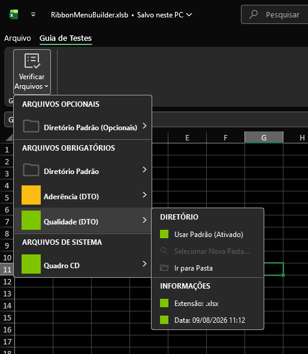

# 🚀 RibbonMenuBuilder



Um framework VBA Orientado a Objetos (OOP) para o Microsoft Excel, desenvolvido para gerar menus dinâmicos na Ribbon (Faixa de Opções). O projeto foca no gerenciamento visual de arquivos, validação de integridade de bases de dados e integração nativa com variáveis do Power Query.

## 📌 Sobre o Projeto

O **RibbonMenuBuilder** resolve o problema de gerenciar múltiplos arquivos de origem (Excel, CSV, XLSB) que alimentam consultas no Power Query. Em vez de menus estáticos, o sistema gera uma interface dinâmica em tempo real (via XML) que informa o status de cada arquivo usando indicadores visuais (Sinalização em Verde, Amarelo e Vermelho) baseados em regras de negócio como: extensão correta, existência no diretório e tempo desde a última modificação.

Tudo é encapsulado em uma única classe mestra (`clsRibbonMenuBuilder`), garantindo um código limpo, modular e de fácil manutenção.

## 💡 Recomendação do Criador

Para um gerenciamento mais eficiente da interface (XML) e inclusão simplificada deste framework no seu projeto Excel, sugere-se fortemente o uso do **[Ribdim](https://github.com/AdrianoFurlim/Ribdim)** — uma IDE especializada que facilita drasticamente o desenvolvimento e a customização da Faixa de Opções do Office.

## ⚙️ Principais Funcionalidades

* **Renderização Dinâmica:** Criação de Seções, Diretórios Padrões e Itens de Arquivo de forma flexível e programática.
* **Validação em Tempo Real (Motor Windows):** Verifica automaticamente se o arquivo existe, valida a extensão e acusa se o arquivo está desatualizado (baseado em um sistema de Enumeração de Tempo: de 10 minutos a 1 semana).
* **CRUD Integrado ao Power Query:** Lê, salva e altera caminhos de diretórios diretamente no código M do Power Query (`let...in`) usando Expressões Regulares (RegEx), dispensando o uso de planilhas de configuração poluídas.
* **Toggle "Usar Padrão":** Sistema inteligente de herança de diretórios. Ao ativar o padrão, o arquivo herda automaticamente o caminho do diretório mestre definido na sua seção.
* **Trava de Segurança:** Método nativo `.ValidarArquivos()` que consolida os erros e emite alertas antes de executar macros críticas, evitando a atualização de dados com bases faltantes ou antigas.
* **Design Clean:** Suporte a separadores nativos do Office com títulos embutidos (`ePdrSeparador`) para uma interface fluida e moderna.

## 🏗️ Arquitetura do Projeto

O sistema é fundamentado no padrão de projeto *Builder* e dividido em 3 camadas principais:

1. **A Casca (XML):** Utiliza o parâmetro `invalidateContentOnDrop="true"` para garantir que o menu limpe o cache e se redesenhe automaticamente sempre que for fechado.
2. **O Cérebro (Módulo de Classe):** A classe `clsRibbonMenuBuilder` contém toda a lógica de estado, validação de Sistema Operacional (File System), geração de *Fluent XML* e manipulação do Power Query.
3. **A Ponte (Módulo Padrão):** Módulos que armazenam os *Callbacks* da Ribbon (ex: `onAction`) e roteiam as chamadas dos botões diretamente para os métodos públicos da classe.

## 🚀 Como Usar

### 1. Configurando a Faixa de Opções (XML)

Certifique-se de configurar a Ribbon com o gatilho dinâmico (no Ribdim ou no Custom UI Editor) ocultando as abas nativas com `startFromScratch="true"`:

```xml
<?xml version="1.0" encoding="UTF-8"?>
<customUI xmlns="[http://schemas.microsoft.com/office/2009/07/customui](http://schemas.microsoft.com/office/2009/07/customui)">
  <ribbon startFromScratch="true">
    <tabs>
      <tab id="tabTeste" label="Guia de Testes">
        <group id="grpArquivos" label="Gerenciamento">
          <dynamicMenu id="tbVerificarArq" 
                       label="Verificar Arquivos" 
                       image="img_checkList"
                       size="large" 
                       getContent="GerarMenuArquivos" 
                       invalidateContentOnDrop="true" />
        </group>
      </tab>
    </tabs>
  </ribbon>
</customUI>
```

### 2. Desenhando o Menu (VBA)

Instancie a classe no módulo que alimentará o callback `getContent` do seu `dynamicMenu`:

```vba
Public Function ConfigurarMenuArquivos() As clsRibbonMenuBuilder
    Dim construtor As New clsRibbonMenuBuilder
    
    ' Define o tamanho do menu principal
    construtor.TamanhoMenuPrincipal = "large"
    
    ' 1. Cria as Seções
    construtor.CriarSecao ID:="OBRIG", Titulo:="ARQUIVOS OBRIGATÓRIOS", TipoCabecalho:=ePdrSeparador
    
    ' 2. Define os Diretórios Padrões
    construtor.AdicionarDiretorioPadrao _
        SecaoID:="OBRIG", _
        Titulo:="Diretório Padrão", _
        VarPQ:="dirPadraoOBRIG", _
        DirAtual:="C:\Sua\Pasta\Padrao\", _
        TamanhoSubmenu:="normal"
    
    ' 3. Adiciona os Arquivos para Validação
    construtor.AdicionarArquivoModular _
        SecaoID:="OBRIG", _
        Nome:="Aderência (DTO)", _
        NomeBusca:="Aderência", _
        Extensao:=".xlsx", _
        DiretorioAlvo:="C:\Pasta\Do\Arquivo\", _
        TagVarEspecifica:="dirAderencia", _
        TagVarPadrao:="dirPadraoOBRIG", _
        ValorPadrao:="C:\Sua\Pasta\Padrao\", _
        AntigoEm:=v1Dia, _
        TamanhoSubmenu:="normal", _
        TipoCabecalhoSubmenu:=eBtnSeparador

    Set ConfigurarMenuArquivos = construtor
End Function
```

### 3. Exibindo o Menu na Tela

O Excel chama automaticamente a função que gera o XML. Basta apontar para a classe configurada:

```vba
Public Function GerarMenuArquivos(control As IRibbonControl, ByRef returnedVal)
    Dim menu As clsRibbonMenuBuilder
    Set menu = ConfigurarMenuArquivos() 
    
    ' Retorna a string XML completa para a interface gráfica
    returnedVal = menu.GerarXML()       
End Function
```

### 4. Aplicando a Trava de Validação

Utilize a mesma configuração visual para validar o projeto antes de disparar rotinas pesadas:

```vba
Sub AtualizarBases() 
    Dim menu As clsRibbonMenuBuilder
    Set menu = ConfigurarMenuArquivos() 
    
    ' Exibe um pop-up detalhado se houver arquivos faltantes, incorretos ou desatualizados
    If Not menu.ValidarArquivos() Then
        Exit Sub ' Aborta a rotina se o usuário cancelar
    End If
    
    ' Prossegue com o processamento dos dados
    ActiveWorkbook.RefreshAll
End Sub
```

## 📄 Licença

Este projeto está sob a licença [MIT](https://choosealicense.com/licenses/mit/). 

**MIT License**

Copyright (c) 2026 Adriano Furtado Lima

A permissão é concedida, a título gratuito, a qualquer pessoa que obtenha uma cópia deste software e dos arquivos de documentação associados (o "Software"), para lidar com o Software sem restrições, incluindo, sem limitação, os direitos de uso, cópia, modificação, fusão, publicação, distribuição, sublicenciamento e/ou venda de cópias do Software, mediante as seguintes condições:

O aviso de copyright acima e este aviso de permissão devem ser incluídos em todas as cópias ou partes substanciais do Software.

O SOFTWARE É FORNECIDO "COMO ESTÁ", SEM GARANTIA DE QUALQUER TIPO, EXPRESSA OU IMPLÍCITA, INCLUINDO MAS NÃO SE LIMITANDO A GARANTIAS DE COMERCIALIZAÇÃO, ADEQUAÇÃO A UM FIM ESPECÍFICO E NÃO INFRAÇÃO. EM NENHUM CASO OS AUTORES OU DETENTORES DE DIREITOS AUTORAIS SERÃO RESPONSÁVEIS POR QUALQUER RECLAMAÇÃO, DANOS OU OUTRA RESPONSABILIDADE, SEJA EM UMA AÇÃO DE CONTRATO, DELITO OU DE OUTRA FORMA, DECORRENTE DE, OU EM CONEXÃO COM O SOFTWARE OU O USO OU OUTRAS NEGOCIAÇÕES NO SOFTWARE.